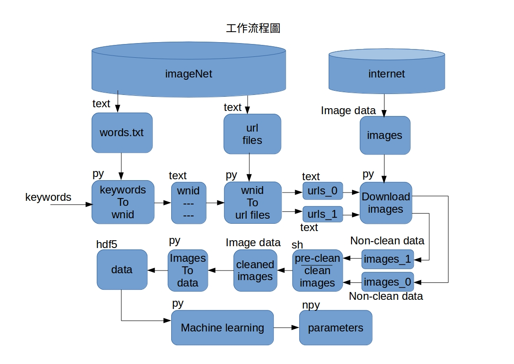

流程圖
-------------------

安裝
-------------------
Ubuntu16.04 安裝依賴套件：
>sudo apt-get install python3-setuptools python3-dev python3-h5py python3-matplotlib python3-psutil

Python3 安裝依賴套件：
>pip3 install -r requirements.txt

工作流程
--------------------
1. keyword2wnid.py   # 產生專案目錄以及wnid 列表檔
2. wnid2url.py   # 利用wnid 列表檔，產生url 列表檔
3. multithreads_download_from_url_files.py   # 利用url 列表檔，下載圖片資料
4. update_url.py   # 清理掉已經下載好的url 列表 (可選)
5. ./pre-clean_images.sh   # 圖片清理
6. ./clean_images.sh   # 圖片清理
7. images2hdf5.py   # 講圖片檔轉成一個資料檔
8. dnn_2_layers_Training.py   # 一層的深度學習
9. dnn_test.ipynb   # 訓練權重測試

> **Note:**

> - 請自行下載url檔，以及words.txt檔，並解壓縮，
> 將文件檔各自放置在urls 和words資料夾裡。
> - imageNet 的分類，有一個重點，她只保證有什麼，
> 但不保證沒什麼。（舉例：像是在human裡，保證有human，
> 但不保證沒有human以外的東西，像是車子、書、狗...等等。）
> - 深度學習的輸出檔名是寫死的，小心覆蓋。

我的環境
--------------------
* OS: ubuntu16.04
* CPU: Intel® Core™ i5-3470 CPU @ 3.20GHz × 4
* RAM: 15.6 GiB
